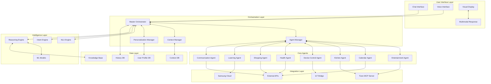
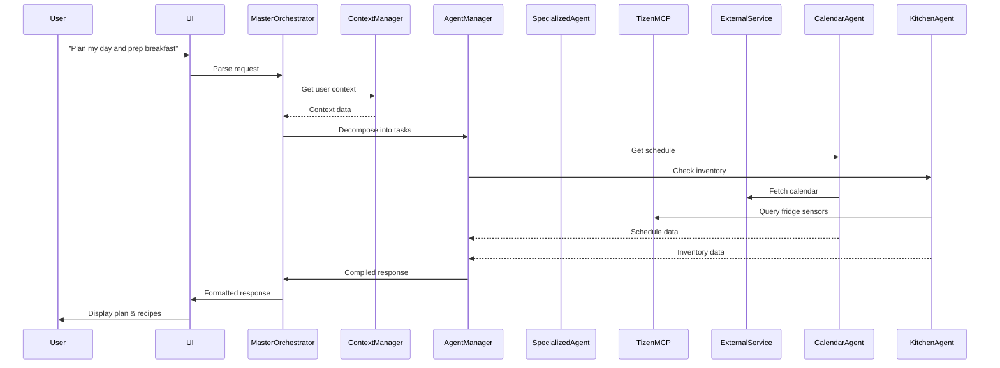

# Samsung Smart Home Assistant Architecture

## Vision
A unified, intelligent, and extensible multi-agent system that transforms Samsung devices into proactive life assistants, starting with Family Hub and scaling to the entire Samsung ecosystem.

## Advanced Scenarios & Use Cases

### 1. Proactive Life Management
- **Morning Routine Orchestration**: System recognizes user wake patterns, adjusts kitchen lighting, starts coffee maker, displays personalized news digest, and briefs on day's schedule
- **Meal Planning Intelligence**: Tracks fridge inventory via computer vision, suggests recipes based on expiring items, dietary preferences, and nutritional goals. Auto-generates shopping lists and can order groceries
- **Family Coordination Hub**: Manages family calendars, assigns chores, tracks homework, coordinates carpools, and sends reminders to family members' devices

### 2. Health & Wellness
- **Nutrition Tracking**: Monitors family dietary habits, suggests healthier alternatives, tracks calorie intake via meal photos
- **Medication Reminders**: Integrates with health apps to remind about medications, tracks adherence, alerts caregivers if missed
- **Exercise Integration**: Syncs with fitness devices, suggests workout times based on calendar, plays motivational content during cooking

### 3. Entertainment & Education
- **Contextual Entertainment**: Suggests content based on who's in kitchen, time available, and preferences. Can continue content across devices
- **Interactive Cooking School**: Step-by-step cooking tutorials with real-time guidance, technique videos, and skill progression tracking
- **Children's Learning Mode**: Educational content during snack time, homework help, science experiments using kitchen items

### 4. Smart Home Orchestration
- **Energy Optimization**: Coordinates with other appliances to optimize energy usage, suggests off-peak usage times
- **Security Integration**: Shows doorbell camera when someone arrives, manages smart locks, monitors home while away
- **Emergency Response**: Detects smoke/gas, calls emergency services, guides evacuation, notifies family members

### 5. Commerce & Services
- **Smart Shopping**: Price comparison across stores, coupon application, bulk buying suggestions, seasonal produce alerts
- **Service Scheduling**: Auto-schedules appliance maintenance, coordinates repair visits, manages warranties
- **Local Services Integration**: Orders takeout, books restaurant reservations, schedules grocery pickup

### 6. Social & Communication
- **Video Calling Hub**: Multi-party video calls during meal prep, virtual cooking together with remote family
- **Social Cooking**: Share recipes with friends, live stream cooking sessions, participate in cooking challenges
- **Voice Messages**: Leave voice/video notes for family members, transcribe and organize family communications

## System Architecture

## Multi-Agent Orchestration Flow

## Technology Stack

- **Core Framework**: Semantic Kernel (C#)
- **Agent Framework**: SK Multi-Agent (MAgentic pattern)
- **Platform Integration**: Tizen MCP Server
- **ML/AI**: Azure OpenAI, Custom Models
- **Message Bus**: MQTT/AMQP for device communication
- **State Management**: Redis for session state
- **Data Storage**: PostgreSQL + TimescaleDB for time-series
- **Caching**: Redis
- **Container**: Docker with Tizen runtime

## Scaling Strategy

1. **Device Abstraction Layer**: Common interface for all Samsung devices
2. **Agent Reusability**: Core agents work across devices with device-specific adapters
3. **Federated Learning**: Devices share learnings while preserving privacy
4. **Edge-Cloud Hybrid**: Critical functions on-device, complex reasoning in cloud
5. **Plugin Architecture**: Third-party developers can add capabilities