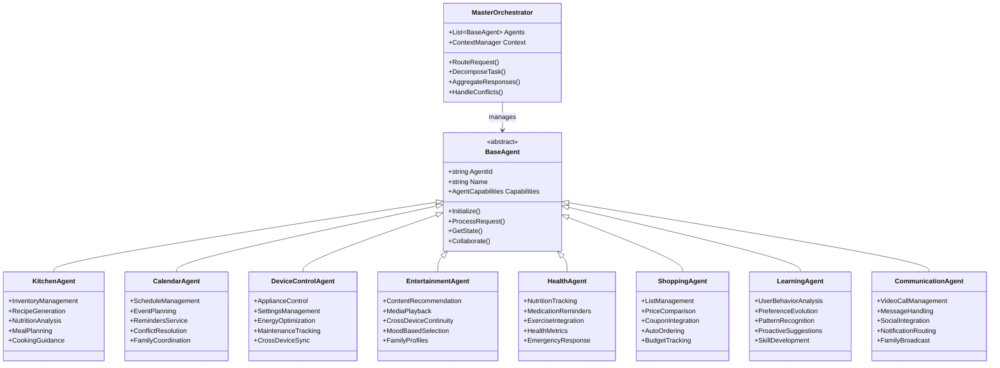
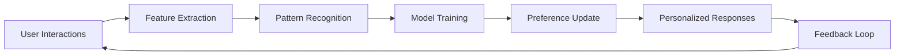
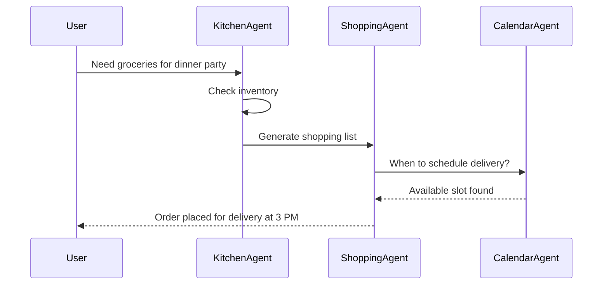

# Agent Definitions and Responsibilities

## Core Agent Architecture



## Detailed Agent Specifications

### 1. Master Orchestrator
**Primary Role**: Central coordination and task decomposition

**Responsibilities**:
- Intent classification and routing
- Multi-agent task decomposition
- Response aggregation and formatting
- Conflict resolution between agents
- Context maintenance across conversations
- Session management

**Key Methods**:
```csharp
public class MasterOrchestrator
{
    public async Task<OrchestratedResponse> ProcessUserRequest(UserRequest request)
    {
        var context = await _contextManager.GetContext(request.UserId);
        var intent = await _intentEngine.Classify(request);
        var taskPlan = await DecomposeIntoTasks(intent, context);
        var agentResponses = await ExecuteTaskPlan(taskPlan);
        return await AggregateResponses(agentResponses);
    }
}
```

### 2. Kitchen Agent
**Primary Role**: Food and kitchen management

**Capabilities**:
- Real-time inventory tracking using Tizen MCP fridge sensors
- Recipe generation based on available ingredients
- Nutrition analysis and dietary tracking
- Meal planning with family preferences
- Step-by-step cooking guidance with timers
- Food waste reduction suggestions
- Expiry date monitoring and alerts

**Integration Points**:
- Tizen MCP: Fridge sensors, temperature controls
- External APIs: Recipe databases, nutrition APIs
- Shopping Agent: Ingredient ordering
- Health Agent: Dietary restrictions

**Example Interaction**:
```yaml
User: "What can I make with what's in my fridge?"
KitchenAgent:
  1. Query fridge inventory via Tizen MCP
  2. Check dietary preferences from user profile
  3. Generate recipe suggestions
  4. Calculate nutrition information
  5. Offer to add missing ingredients to shopping list
```

### 3. Calendar Agent
**Primary Role**: Schedule and time management

**Capabilities**:
- Multi-calendar synchronization
- Intelligent scheduling with travel time
- Family calendar coordination
- Reminder management with context
- Meeting preparation assistance
- Time blocking for tasks
- Schedule optimization

**Integration Points**:
- External calendars (Google, Outlook, Samsung)
- Device Control Agent: Home automation based on schedule
- Communication Agent: Meeting notifications

### 4. Device Control Agent
**Primary Role**: Smart home device management

**Capabilities**:
- Appliance control and monitoring
- Energy usage optimization
- Predictive maintenance alerts
- Scene management (morning, cooking, night)
- Cross-device synchronization
- Security system integration
- Climate control

**Tizen MCP Integration**:
```csharp
public class DeviceControlAgent : BaseAgent
{
    private ITizenMCPClient _mcpClient;
    
    public async Task<DeviceState> SetAppliance(string deviceId, Settings settings)
    {
        var request = new MCPRequest
        {
            DeviceId = deviceId,
            Action = "SET_STATE",
            Parameters = settings.ToMCPParams()
        };
        return await _mcpClient.Execute(request);
    }
}
```

### 5. Entertainment Agent
**Primary Role**: Content and media management

**Capabilities**:
- Personalized content recommendations
- Multi-profile family management
- Cross-device content continuity
- Mood-based playlist generation
- Live TV and streaming integration
- Interactive content during cooking
- Background entertainment selection

**Samsung Ecosystem Features**:
- Samsung TV Plus integration
- Galaxy device casting
- Bixby routine integration
- SmartThings entertainment scenes

### 6. Health Agent
**Primary Role**: Health and wellness tracking

**Capabilities**:
- Nutrition goal tracking
- Medication reminder system
- Fitness integration (Samsung Health)
- Allergy and dietary restriction management
- Emergency contact system
- Health metric monitoring
- Wellness suggestions

**Critical Features**:
- HIPAA compliance for health data
- Emergency detection and response
- Caregiver notification system

### 7. Shopping Agent
**Primary Role**: Shopping and inventory management

**Capabilities**:
- Automated shopping list generation
- Price comparison across stores
- Coupon and deal finding
- Budget tracking and alerts
- Bulk buying optimization
- Subscription management
- Grocery delivery scheduling

**E-commerce Integration**:
```yaml
ShoppingFlow:
  InventoryCheck: Query KitchenAgent
  ListGeneration: Based on meal plans
  PriceOptimization: Compare across stores
  OrderPlacement: Via partner APIs
  DeliveryScheduling: Coordinate with CalendarAgent
```

### 8. Learning Agent
**Primary Role**: Personalization and adaptation

**Capabilities**:
- User behavior pattern recognition
- Preference evolution tracking
- Proactive suggestion generation
- Family member distinction
- Usage analytics
- Skill progression tracking
- A/B testing for improvements

**Machine Learning Pipeline**:


### 9. Communication Agent
**Primary Role**: Communication and messaging

**Capabilities**:
- Video call management on display
- Voice/video message system
- Family broadcast system
- Social media integration
- Notification management
- Emergency broadcast
- Remote family connection

## Agent Collaboration Patterns

### 1. Sequential Collaboration


### 2. Parallel Collaboration
Multiple agents work simultaneously on different aspects of a request

### 3. Hierarchical Collaboration
Master orchestrator delegates to specialized agents based on expertise

## Agent State Management

Each agent maintains:
- **Local State**: Agent-specific data and cache
- **Shared Context**: User preferences, current session
- **Collaboration State**: Inter-agent communication tracking
- **Learning State**: Personalization models and history

## Performance Metrics

- Response latency < 500ms for local operations
- Cross-agent communication < 100ms
- State synchronization every 30 seconds
- Cache hit ratio > 80% for common queries