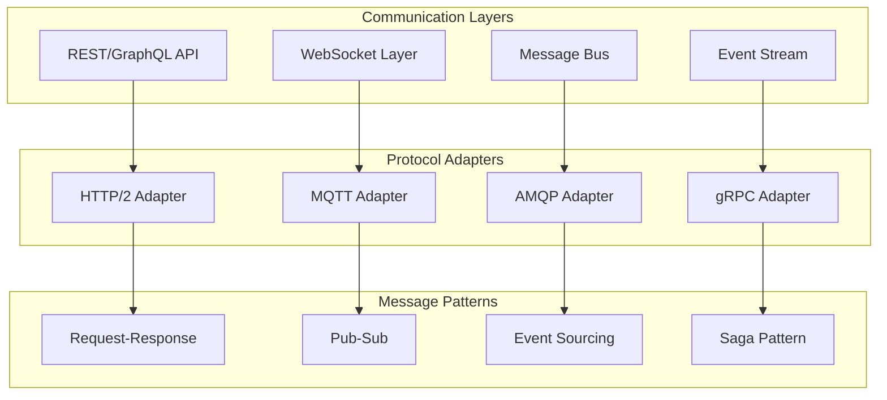

# API Contracts and Communication Patterns

## Communication Architecture



## Core API Contracts

### 1. Agent Communication Contract
```csharp
namespace FamilyHub.Contracts
{
    // Base message contract
    public interface IAgentMessage
    {
        Guid MessageId { get; }
        string SenderId { get; }
        string RecipientId { get; }
        DateTime Timestamp { get; }
        MessagePriority Priority { get; }
        Dictionary<string, object> Headers { get; }
        object Payload { get; }
    }
    
    // Request contract
    public class AgentRequest : IAgentMessage
    {
        public Guid MessageId { get; set; } = Guid.NewGuid();
        public string SenderId { get; set; }
        public string RecipientId { get; set; }
        public DateTime Timestamp { get; set; } = DateTime.UtcNow;
        public MessagePriority Priority { get; set; } = MessagePriority.Normal;
        public Dictionary<string, object> Headers { get; set; } = new();
        public object Payload { get; set; }
        
        public string Intent { get; set; }
        public Dictionary<string, object> Parameters { get; set; }
        public TimeSpan Timeout { get; set; } = TimeSpan.FromSeconds(30);
        public bool RequiresResponse { get; set; } = true;
    }
    
    // Response contract
    public class AgentResponse : IAgentMessage
    {
        public Guid MessageId { get; set; } = Guid.NewGuid();
        public Guid CorrelationId { get; set; }
        public string SenderId { get; set; }
        public string RecipientId { get; set; }
        public DateTime Timestamp { get; set; } = DateTime.UtcNow;
        public MessagePriority Priority { get; set; }
        public Dictionary<string, object> Headers { get; set; } = new();
        public object Payload { get; set; }
        
        public ResponseStatus Status { get; set; }
        public string ErrorMessage { get; set; }
        public Dictionary<string, object> Data { get; set; }
    }
    
    public enum ResponseStatus
    {
        Success,
        PartialSuccess,
        Failed,
        Timeout,
        Unauthorized,
        NotSupported
    }
}
```

### 2. User Interaction Contract
```yaml
openapi: 3.0.0
info:
  title: Family Hub Assistant API
  version: 1.0.0
  
paths:
  /api/v1/chat:
    post:
      summary: Send chat message
      requestBody:
        content:
          application/json:
            schema:
              type: object
              properties:
                userId:
                  type: string
                sessionId:
                  type: string
                message:
                  type: string
                context:
                  type: object
                attachments:
                  type: array
                  items:
                    type: object
      responses:
        200:
          description: Successful response
          content:
            application/json:
              schema:
                type: object
                properties:
                  responseId:
                    type: string
                  message:
                    type: string
                  actions:
                    type: array
                  visualElements:
                    type: array
                  suggestedActions:
                    type: array
                    
  /api/v1/voice:
    post:
      summary: Process voice command
      requestBody:
        content:
          multipart/form-data:
            schema:
              type: object
              properties:
                audio:
                  type: string
                  format: binary
                sampleRate:
                  type: integer
                language:
                  type: string
                    
  /api/v1/context:
    get:
      summary: Get user context
      parameters:
        - name: userId
          in: query
          required: true
          schema:
            type: string
      responses:
        200:
          description: User context
          content:
            application/json:
              schema:
                $ref: '#/components/schemas/UserContext'
                
components:
  schemas:
    UserContext:
      type: object
      properties:
        userId:
          type: string
        preferences:
          type: object
        recentActivities:
          type: array
        deviceStates:
          type: array
        familyMembers:
          type: array
```

### 3. Device Control Contract
```protobuf
syntax = "proto3";

package familyhub.device;

service DeviceControl {
  rpc GetState(GetStateRequest) returns (DeviceState);
  rpc SetState(SetStateRequest) returns (SetStateResponse);
  rpc ExecuteAction(ActionRequest) returns (ActionResponse);
  rpc StreamEvents(StreamRequest) returns (stream DeviceEvent);
}

message GetStateRequest {
  string device_id = 1;
  repeated string properties = 2;
}

message DeviceState {
  string device_id = 1;
  map<string, google.protobuf.Any> properties = 2;
  int64 timestamp = 3;
}

message SetStateRequest {
  string device_id = 1;
  map<string, google.protobuf.Any> properties = 2;
  bool validate_before_apply = 3;
}

message SetStateResponse {
  bool success = 1;
  string error_message = 2;
  DeviceState new_state = 3;
}

message ActionRequest {
  string device_id = 1;
  string action = 2;
  map<string, google.protobuf.Any> parameters = 3;
  int32 timeout_ms = 4;
}

message ActionResponse {
  bool success = 1;
  string error_message = 2;
  map<string, google.protobuf.Any> result = 3;
  int64 execution_time_ms = 4;
}

message DeviceEvent {
  string device_id = 1;
  string event_type = 2;
  map<string, google.protobuf.Any> data = 3;
  int64 timestamp = 4;
}
```

## Message Bus Architecture

### Event-Driven Communication
```csharp
public interface IMessageBus
{
    Task PublishAsync<T>(T message) where T : IAgentMessage;
    Task<TResponse> SendAsync<TRequest, TResponse>(TRequest request) 
        where TRequest : IAgentMessage 
        where TResponse : IAgentMessage;
    IDisposable Subscribe<T>(Action<T> handler) where T : IAgentMessage;
    IDisposable SubscribeAsync<T>(Func<T, Task> handler) where T : IAgentMessage;
}

public class MessageBus : IMessageBus
{
    private readonly IServiceBusClient _serviceBus;
    private readonly ISerializer _serializer;
    private readonly Dictionary<Type, List<Delegate>> _handlers;
    
    public async Task PublishAsync<T>(T message) where T : IAgentMessage
    {
        var serialized = _serializer.Serialize(message);
        var busMessage = new ServiceBusMessage(serialized)
        {
            MessageId = message.MessageId.ToString(),
            Subject = typeof(T).Name,
            ApplicationProperties =
            {
                ["SenderId"] = message.SenderId,
                ["Priority"] = message.Priority.ToString(),
                ["Timestamp"] = message.Timestamp
            }
        };
        
        await _serviceBus.SendMessageAsync(busMessage);
        
        // Local handlers
        if (_handlers.TryGetValue(typeof(T), out var handlers))
        {
            foreach (var handler in handlers)
            {
                if (handler is Action<T> syncHandler)
                {
                    syncHandler(message);
                }
                else if (handler is Func<T, Task> asyncHandler)
                {
                    await asyncHandler(message);
                }
            }
        }
    }
    
    public async Task<TResponse> SendAsync<TRequest, TResponse>(TRequest request)
        where TRequest : IAgentMessage
        where TResponse : IAgentMessage
    {
        var tcs = new TaskCompletionSource<TResponse>();
        var correlationId = Guid.NewGuid();
        
        // Set up response handler
        var subscription = Subscribe<TResponse>(response =>
        {
            if (response is AgentResponse agentResponse && 
                agentResponse.CorrelationId == correlationId)
            {
                tcs.SetResult(response);
            }
        });
        
        // Send request
        if (request is AgentRequest agentRequest)
        {
            agentRequest.Headers["CorrelationId"] = correlationId;
        }
        
        await PublishAsync(request);
        
        // Wait for response with timeout
        using (var cts = new CancellationTokenSource(TimeSpan.FromSeconds(30)))
        {
            try
            {
                return await tcs.Task.WaitAsync(cts.Token);
            }
            finally
            {
                subscription.Dispose();
            }
        }
    }
}
```

## Communication Patterns

### 1. Request-Response Pattern
```csharp
public class RequestResponsePattern
{
    private readonly IMessageBus _messageBus;
    
    public async Task<RecipeResponse> GetRecipeRecommendation(string userId)
    {
        var request = new AgentRequest
        {
            SenderId = "UserInterface",
            RecipientId = "KitchenAgent",
            Intent = "GetRecipeRecommendation",
            Parameters = new Dictionary<string, object>
            {
                ["userId"] = userId,
                ["mealType"] = "dinner",
                ["maxPrepTime"] = 30
            }
        };
        
        var response = await _messageBus.SendAsync<AgentRequest, RecipeResponse>(request);
        return response;
    }
}
```

### 2. Publish-Subscribe Pattern
```csharp
public class PublishSubscribePattern
{
    private readonly IMessageBus _messageBus;
    
    public void SetupEventHandlers()
    {
        // Subscribe to fridge door events
        _messageBus.Subscribe<FridgeDoorEvent>(async evt =>
        {
            if (evt.DurationOpen > TimeSpan.FromMinutes(1))
            {
                await NotifyUser("Fridge door has been open for over a minute");
            }
        });
        
        // Subscribe to inventory changes
        _messageBus.Subscribe<InventoryChangeEvent>(async evt =>
        {
            if (evt.ItemsExpiringSoon.Any())
            {
                await SuggestRecipesForExpiringItems(evt.ItemsExpiringSoon);
            }
        });
    }
}
```

### 3. Saga Pattern for Complex Workflows
```csharp
public class MealPlanningOrchestrator
{
    private readonly ISagaCoordinator _sagaCoordinator;
    
    public async Task<MealPlan> CreateWeeklyMealPlan(string familyId)
    {
        var saga = new MealPlanningSaga
        {
            Steps = new List<ISagaStep>
            {
                new GetFamilyPreferencesStep(),
                new CheckInventoryStep(),
                new GenerateMealIdeasStep(),
                new ValidateNutritionStep(),
                new CreateShoppingListStep(),
                new ScheduleMealsStep()
            },
            CompensationSteps = new List<ISagaStep>
            {
                new RollbackScheduleStep(),
                new RollbackShoppingListStep()
            }
        };
        
        return await _sagaCoordinator.ExecuteAsync<MealPlan>(saga, new
        {
            FamilyId = familyId,
            StartDate = DateTime.Today,
            Days = 7
        });
    }
}

public interface ISagaStep
{
    Task<StepResult> ExecuteAsync(SagaContext context);
    Task CompensateAsync(SagaContext context);
}

public class GetFamilyPreferencesStep : ISagaStep
{
    public async Task<StepResult> ExecuteAsync(SagaContext context)
    {
        var familyId = context.GetValue<string>("FamilyId");
        var preferences = await GetPreferencesAsync(familyId);
        
        context.SetValue("Preferences", preferences);
        return StepResult.Success();
    }
    
    public async Task CompensateAsync(SagaContext context)
    {
        // No compensation needed for read operation
    }
}
```

### 4. Event Sourcing Pattern
```csharp
public class EventStore
{
    private readonly IEventDatabase _database;
    
    public async Task AppendAsync(DomainEvent evt)
    {
        var eventData = new EventData
        {
            EventId = Guid.NewGuid(),
            EventType = evt.GetType().Name,
            AggregateId = evt.AggregateId,
            Data = JsonSerializer.Serialize(evt),
            Metadata = evt.Metadata,
            Timestamp = evt.Timestamp,
            Version = evt.Version
        };
        
        await _database.AppendToStreamAsync(evt.AggregateId, eventData);
    }
    
    public async Task<List<DomainEvent>> GetEventsAsync(string aggregateId, int fromVersion = 0)
    {
        var events = await _database.ReadStreamAsync(aggregateId, fromVersion);
        return events.Select(DeserializeEvent).ToList();
    }
}

public abstract class DomainEvent
{
    public string AggregateId { get; set; }
    public int Version { get; set; }
    public DateTime Timestamp { get; set; } = DateTime.UtcNow;
    public Dictionary<string, object> Metadata { get; set; } = new();
}

public class RecipeCreatedEvent : DomainEvent
{
    public string RecipeId { get; set; }
    public string Name { get; set; }
    public List<string> Ingredients { get; set; }
    public int PrepTimeMinutes { get; set; }
}
```

## WebSocket Real-time Communication

### WebSocket Manager
```csharp
public class WebSocketManager
{
    private readonly ConcurrentDictionary<string, WebSocketConnection> _connections;
    
    public async Task HandleConnectionAsync(WebSocket webSocket, string userId)
    {
        var connection = new WebSocketConnection
        {
            Id = Guid.NewGuid().ToString(),
            UserId = userId,
            WebSocket = webSocket,
            ConnectedAt = DateTime.UtcNow
        };
        
        _connections[connection.Id] = connection;
        
        try
        {
            await ProcessMessagesAsync(connection);
        }
        finally
        {
            _connections.TryRemove(connection.Id, out _);
        }
    }
    
    public async Task BroadcastToUserAsync(string userId, object message)
    {
        var userConnections = _connections.Values
            .Where(c => c.UserId == userId)
            .ToList();
        
        var json = JsonSerializer.Serialize(message);
        var bytes = Encoding.UTF8.GetBytes(json);
        
        foreach (var connection in userConnections)
        {
            if (connection.WebSocket.State == WebSocketState.Open)
            {
                await connection.WebSocket.SendAsync(
                    new ArraySegment<byte>(bytes),
                    WebSocketMessageType.Text,
                    true,
                    CancellationToken.None);
            }
        }
    }
}
```

## Error Handling & Resilience

### Circuit Breaker Pattern
```csharp
public class CircuitBreaker
{
    private readonly int _threshold;
    private readonly TimeSpan _timeout;
    private int _failureCount;
    private DateTime _lastFailureTime;
    private CircuitState _state = CircuitState.Closed;
    
    public async Task<T> ExecuteAsync<T>(Func<Task<T>> action)
    {
        if (_state == CircuitState.Open)
        {
            if (DateTime.UtcNow - _lastFailureTime > _timeout)
            {
                _state = CircuitState.HalfOpen;
            }
            else
            {
                throw new CircuitBreakerOpenException();
            }
        }
        
        try
        {
            var result = await action();
            
            if (_state == CircuitState.HalfOpen)
            {
                _state = CircuitState.Closed;
                _failureCount = 0;
            }
            
            return result;
        }
        catch (Exception ex)
        {
            _failureCount++;
            _lastFailureTime = DateTime.UtcNow;
            
            if (_failureCount >= _threshold)
            {
                _state = CircuitState.Open;
            }
            
            throw;
        }
    }
}
```

## Performance Monitoring

### Telemetry Contract
```csharp
public interface ITelemetryCollector
{
    void RecordMetric(string name, double value, Dictionary<string, string> tags = null);
    void RecordLatency(string operation, TimeSpan duration);
    void RecordError(string operation, Exception exception);
    IDisposable StartOperation(string name);
}

public class TelemetryCollector : ITelemetryCollector
{
    private readonly ITelemetryClient _client;
    
    public void RecordLatency(string operation, TimeSpan duration)
    {
        _client.TrackMetric($"{operation}.duration", duration.TotalMilliseconds,
            new Dictionary<string, string>
            {
                ["operation"] = operation,
                ["unit"] = "milliseconds"
            });
    }
    
    public IDisposable StartOperation(string name)
    {
        return new OperationScope(name, this);
    }
    
    private class OperationScope : IDisposable
    {
        private readonly string _name;
        private readonly ITelemetryCollector _collector;
        private readonly Stopwatch _stopwatch;
        
        public OperationScope(string name, ITelemetryCollector collector)
        {
            _name = name;
            _collector = collector;
            _stopwatch = Stopwatch.StartNew();
        }
        
        public void Dispose()
        {
            _stopwatch.Stop();
            _collector.RecordLatency(_name, _stopwatch.Elapsed);
        }
    }
}
```