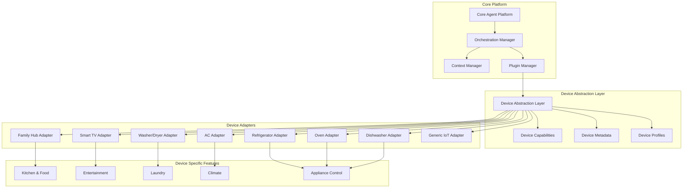
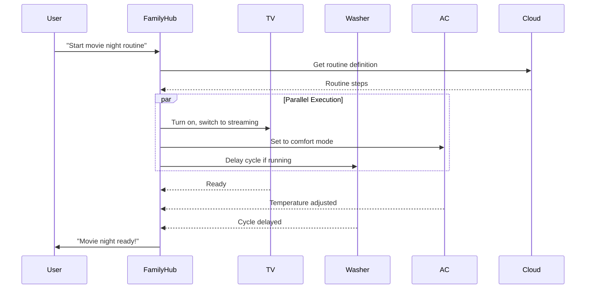

# Device Extensibility Framework

## Overview
This framework enables the multi-agent system to scale seamlessly across the Samsung ecosystem, from Family Hub to TVs, washers, air conditioners, and future devices.

## Device Abstraction Architecture



## Device Profile System

### Base Device Profile
```csharp
namespace FamilyHub.Extensibility
{
    public abstract class DeviceProfile
    {
        public string DeviceId { get; set; }
        public string DeviceType { get; set; }
        public string ModelNumber { get; set; }
        public string FirmwareVersion { get; set; }
        public DeviceCapabilities Capabilities { get; set; }
        public DeviceConstraints Constraints { get; set; }
        public DeviceMetadata Metadata { get; set; }
        
        public abstract Task<bool> ValidateCapability(string capability);
        public abstract Task<DeviceState> GetStateAsync();
        public abstract Task<bool> ExecuteActionAsync(DeviceAction action);
    }
    
    public class DeviceCapabilities
    {
        public List<string> SupportedActions { get; set; }
        public List<string> SupportedSensors { get; set; }
        public DisplayCapabilities Display { get; set; }
        public AudioCapabilities Audio { get; set; }
        public NetworkCapabilities Network { get; set; }
        public ProcessingCapabilities Processing { get; set; }
        public List<string> SupportedAgents { get; set; }
    }
    
    public class DeviceConstraints
    {
        public int MaxConcurrentOperations { get; set; }
        public int MemoryLimitMB { get; set; }
        public int StorageLimitMB { get; set; }
        public List<string> RestrictedFeatures { get; set; }
        public TimeSpan MaxSessionDuration { get; set; }
    }
}
```

## Device-Specific Implementations

### 1. Smart TV Profile
```csharp
public class SmartTVProfile : DeviceProfile
{
    public SmartTVProfile()
    {
        DeviceType = "SmartTV";
        Capabilities = new DeviceCapabilities
        {
            SupportedActions = new List<string>
            {
                "channel.change",
                "volume.control",
                "app.launch",
                "content.play",
                "screen.mirror",
                "ambient.mode"
            },
            Display = new DisplayCapabilities
            {
                Resolution = "3840x2160",
                HDRSupport = true,
                RefreshRate = 120,
                MultiView = true
            },
            Audio = new AudioCapabilities
            {
                Channels = "5.1",
                DolbyAtmos = true,
                BluetoothAudio = true
            },
            SupportedAgents = new List<string>
            {
                "EntertainmentAgent",
                "DeviceControlAgent",
                "CommunicationAgent"
            }
        };
    }
    
    public override async Task<bool> ExecuteActionAsync(DeviceAction action)
    {
        return action.Type switch
        {
            "channel.change" => await ChangeChannelAsync(action.Parameters),
            "content.play" => await PlayContentAsync(action.Parameters),
            "app.launch" => await LaunchAppAsync(action.Parameters),
            _ => false
        };
    }
}
```

### 2. Washer/Dryer Profile
```csharp
public class WasherDryerProfile : DeviceProfile
{
    public WasherDryerProfile()
    {
        DeviceType = "WasherDryer";
        Capabilities = new DeviceCapabilities
        {
            SupportedActions = new List<string>
            {
                "cycle.start",
                "cycle.pause",
                "cycle.stop",
                "settings.adjust",
                "schedule.delay",
                "diagnostic.run"
            },
            SupportedSensors = new List<string>
            {
                "load.weight",
                "water.level",
                "temperature",
                "vibration",
                "door.status",
                "cycle.progress"
            },
            SupportedAgents = new List<string>
            {
                "DeviceControlAgent",
                "CalendarAgent",
                "LearningAgent"
            }
        };
    }
    
    public LaundryCapabilities LaundrySpecific { get; set; } = new()
    {
        CycleTypes = new[] { "Normal", "Delicate", "Heavy", "Quick", "Eco" },
        SmartCareEnabled = true,
        AIWashEnabled = true,
        RemoteStart = true,
        EnergyMonitoring = true
    };
}
```

### 3. Air Conditioner Profile
```csharp
public class AirConditionerProfile : DeviceProfile
{
    public AirConditionerProfile()
    {
        DeviceType = "AirConditioner";
        Capabilities = new DeviceCapabilities
        {
            SupportedActions = new List<string>
            {
                "power.toggle",
                "temperature.set",
                "mode.change",
                "fan.speed",
                "swing.control",
                "schedule.set",
                "filter.check"
            },
            SupportedSensors = new List<string>
            {
                "room.temperature",
                "humidity",
                "air.quality",
                "filter.status",
                "energy.consumption"
            },
            SupportedAgents = new List<string>
            {
                "DeviceControlAgent",
                "HealthAgent",
                "LearningAgent"
            }
        };
    }
    
    public ClimateCapabilities ClimateSpecific { get; set; } = new()
    {
        WindFreeMode = true,
        AIComfort = true,
        MultiRoom = true,
        MotionDetection = true,
        AutoCleaning = true
    };
}
```

## Cross-Device Orchestration

### Device Discovery & Registration
```csharp
public class DeviceDiscoveryService
{
    private readonly IServiceBus _serviceBus;
    private readonly IDeviceRegistry _registry;
    
    public async Task<List<DiscoveredDevice>> DiscoverDevicesAsync()
    {
        var devices = new List<DiscoveredDevice>();
        
        // SmartThings discovery
        devices.AddRange(await DiscoverSmartThingsDevicesAsync());
        
        // mDNS/Bonjour discovery
        devices.AddRange(await DiscoverMDNSDevicesAsync());
        
        // Bluetooth discovery
        devices.AddRange(await DiscoverBluetoothDevicesAsync());
        
        // Cloud-registered devices
        devices.AddRange(await DiscoverCloudDevicesAsync());
        
        return devices;
    }
    
    public async Task RegisterDeviceAsync(DiscoveredDevice device)
    {
        // Load device profile
        var profile = await LoadDeviceProfileAsync(device.ModelNumber);
        
        // Create device adapter
        var adapter = CreateAdapter(profile);
        
        // Register with system
        await _registry.RegisterAsync(new RegisteredDevice
        {
            Id = device.Id,
            Profile = profile,
            Adapter = adapter,
            Status = DeviceStatus.Online,
            LastSeen = DateTime.UtcNow
        });
        
        // Announce to agents
        await _serviceBus.PublishAsync(new DeviceRegisteredEvent(device));
    }
}
```

### Cross-Device Scenarios



## Plugin Architecture

### Agent Plugin System
```csharp
public interface IAgentPlugin
{
    string PluginId { get; }
    string Name { get; }
    Version Version { get; }
    List<string> SupportedDeviceTypes { get; }
    
    Task InitializeAsync(IPluginContext context);
    Task<bool> CanHandleAsync(DeviceAction action);
    Task<ActionResult> ExecuteAsync(DeviceAction action);
    Task ShutdownAsync();
}

public class PluginManager
{
    private readonly Dictionary<string, IAgentPlugin> _plugins;
    private readonly IPluginLoader _loader;
    
    public async Task LoadPluginAsync(string pluginPath)
    {
        var assembly = Assembly.LoadFrom(pluginPath);
        var pluginTypes = assembly.GetTypes()
            .Where(t => typeof(IAgentPlugin).IsAssignableFrom(t));
        
        foreach (var type in pluginTypes)
        {
            var plugin = Activator.CreateInstance(type) as IAgentPlugin;
            await plugin.InitializeAsync(CreateContext());
            _plugins[plugin.PluginId] = plugin;
        }
    }
    
    public async Task<ActionResult> RouteActionAsync(DeviceAction action)
    {
        var capablePlugins = new List<IAgentPlugin>();
        
        foreach (var plugin in _plugins.Values)
        {
            if (await plugin.CanHandleAsync(action))
            {
                capablePlugins.Add(plugin);
            }
        }
        
        if (capablePlugins.Any())
        {
            var selectedPlugin = SelectBestPlugin(capablePlugins, action);
            return await selectedPlugin.ExecuteAsync(action);
        }
        
        return ActionResult.NotSupported();
    }
}
```

## Device Capability Negotiation

### Dynamic Capability Discovery
```csharp
public class CapabilityNegotiator
{
    public async Task<NegotiatedCapabilities> NegotiateAsync(
        DeviceProfile device,
        RequestedCapabilities requested)
    {
        var negotiated = new NegotiatedCapabilities();
        
        // Check device capabilities
        foreach (var capability in requested.Required)
        {
            if (!device.Capabilities.Supports(capability))
            {
                throw new CapabilityNotSupportedException(capability);
            }
            negotiated.Add(capability);
        }
        
        // Check optional capabilities
        foreach (var capability in requested.Optional)
        {
            if (device.Capabilities.Supports(capability))
            {
                negotiated.Add(capability);
            }
        }
        
        // Check for alternatives
        foreach (var capability in requested.Alternatives)
        {
            var alternative = device.Capabilities.FindAlternative(capability);
            if (alternative != null)
            {
                negotiated.AddAlternative(capability, alternative);
            }
        }
        
        return negotiated;
    }
}
```

## Scaling Considerations

### 1. Resource Management
```yaml
ResourceAllocation:
  PerDevice:
    Memory: 50-200MB based on profile
    CPU: 1-5% per active device
    Network: Throttled to 1Mbps per device
    
  Scaling:
    MaxDevices: 100 per hub
    MaxConcurrentOperations: 20
    QueueDepth: 1000 operations
```

### 2. Performance Optimization
```csharp
public class DeviceConnectionPool
{
    private readonly ConcurrentDictionary<string, IDeviceConnection> _connections;
    private readonly SemaphoreSlim _connectionSemaphore;
    
    public async Task<IDeviceConnection> GetConnectionAsync(string deviceId)
    {
        if (_connections.TryGetValue(deviceId, out var existing))
        {
            if (existing.IsHealthy)
                return existing;
        }
        
        await _connectionSemaphore.WaitAsync();
        try
        {
            var connection = await CreateConnectionAsync(deviceId);
            _connections[deviceId] = connection;
            return connection;
        }
        finally
        {
            _connectionSemaphore.Release();
        }
    }
}
```

### 3. Fallback Mechanisms
```csharp
public class DeviceFallbackHandler
{
    public async Task<ActionResult> ExecuteWithFallbackAsync(
        DeviceAction action,
        DeviceProfile primary,
        List<DeviceProfile> alternatives)
    {
        try
        {
            return await primary.ExecuteActionAsync(action);
        }
        catch (DeviceUnavailableException)
        {
            foreach (var alternative in alternatives)
            {
                if (await alternative.CanExecuteAsync(action))
                {
                    return await alternative.ExecuteActionAsync(action);
                }
            }
            
            return ActionResult.Failed("No available device can execute action");
        }
    }
}
```

## Migration Path

### Phase 1: Family Hub Foundation
- Core agent system
- Kitchen-specific features
- Basic device control

### Phase 2: Entertainment Devices
- Smart TV integration
- Audio system control
- Content synchronization

### Phase 3: Home Appliances
- Washer/Dryer
- Dishwasher
- Oven/Microwave

### Phase 4: Climate & Comfort
- Air conditioners
- Air purifiers
- Robot vacuums

### Phase 5: Full Ecosystem
- Wearables integration
- Mobile device coordination
- Car integration