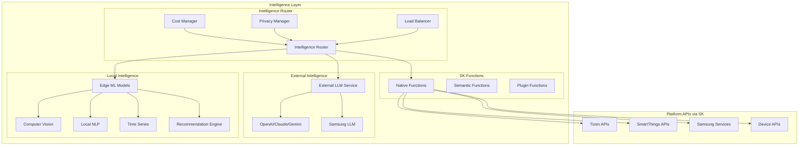

# Intelligence Layer Architecture

## Overview
Hybrid intelligence system combining external LLMs, local ML models, and Semantic Kernel functions for optimal performance and privacy.

## Intelligence Architecture



## Hybrid Intelligence Implementation

### 1. Intelligence Router
```csharp
using Microsoft.SemanticKernel;

public class IntelligenceRouter
{
    private readonly IKernel _kernel;
    private readonly ILocalMLService _localML;
    private readonly ICostManager _costManager;
    private readonly IPrivacyManager _privacyManager;
    
    public IntelligenceRouter(IKernel kernel)
    {
        _kernel = kernel;
        ConfigureIntelligencePipeline();
    }
    
    private void ConfigureIntelligencePipeline()
    {
        // Configure routing rules
        _kernel.AddIntelligenceRoute("privacy_sensitive", RouteToLocal);
        _kernel.AddIntelligenceRoute("complex_reasoning", RouteToLLM);
        _kernel.AddIntelligenceRoute("real_time", RouteToEdge);
        _kernel.AddIntelligenceRoute("platform_control", RouteToNative);
    }
    
    public async Task<IntelligenceResponse> ProcessRequestAsync(IntelligenceRequest request)
    {
        // Determine best routing based on request characteristics
        var routingDecision = await DetermineRouting(request);
        
        switch (routingDecision.Target)
        {
            case IntelligenceTarget.LocalML:
                return await ProcessWithLocalML(request);
                
            case IntelligenceTarget.ExternalLLM:
                return await ProcessWithLLM(request);
                
            case IntelligenceTarget.NativeFunction:
                return await ProcessWithNativeFunction(request);
                
            case IntelligenceTarget.Hybrid:
                return await ProcessHybrid(request);
                
            default:
                return await ProcessWithDefault(request);
        }
    }
    
    private async Task<RoutingDecision> DetermineRouting(IntelligenceRequest request)
    {
        var decision = new RoutingDecision();
        
        // Check privacy requirements
        if (_privacyManager.RequiresLocalProcessing(request))
        {
            decision.Target = IntelligenceTarget.LocalML;
            return decision;
        }
        
        // Check latency requirements
        if (request.MaxLatency < TimeSpan.FromMilliseconds(100))
        {
            decision.Target = IntelligenceTarget.LocalML;
            return decision;
        }
        
        // Check complexity
        if (request.RequiresReasoning || request.RequiresCreativity)
        {
            decision.Target = IntelligenceTarget.ExternalLLM;
            decision.Model = SelectOptimalLLM(request);
            return decision;
        }
        
        // Check if platform API is sufficient
        if (CanHandleWithNativeFunction(request))
        {
            decision.Target = IntelligenceTarget.NativeFunction;
            return decision;
        }
        
        // Default to hybrid approach
        decision.Target = IntelligenceTarget.Hybrid;
        return decision;
    }
}
```

### 2. Local ML Models
```csharp
public class LocalMLService
{
    private readonly Dictionary<string, ILocalModel> _models;
    
    public LocalMLService()
    {
        _models = new Dictionary<string, ILocalModel>
        {
            ["vision"] = new LocalVisionModel(),
            ["nlp"] = new LocalNLPModel(),
            ["timeseries"] = new TimeSeriesModel(),
            ["recommendation"] = new RecommendationModel(),
            ["anomaly"] = new AnomalyDetectionModel()
        };
    }
    
    // Computer Vision for Fridge Inventory
    public class LocalVisionModel : ILocalModel
    {
        private readonly ONNXRuntime _runtime;
        
        public async Task<InventoryDetection> DetectInventoryAsync(byte[] image)
        {
            // YOLO or MobileNet for object detection
            var detections = await _runtime.RunAsync("yolov5_fridge.onnx", image);
            
            return new InventoryDetection
            {
                Items = detections.Select(d => new InventoryItem
                {
                    Name = d.Label,
                    Confidence = d.Confidence,
                    Quantity = EstimateQuantity(d),
                    Location = d.BoundingBox
                }).ToList()
            };
        }
        
        public async Task<FreshnessScore> AssessFreshnessAsync(byte[] image, string itemType)
        {
            // Custom trained model for freshness detection
            var features = await ExtractFreshnessFeatures(image);
            var score = await _runtime.RunAsync("freshness_model.onnx", features);
            
            return new FreshnessScore
            {
                Score = score,
                DaysRemaining = EstimateDaysRemaining(score, itemType),
                Confidence = CalculateConfidence(features)
            };
        }
    }
    
    // Local NLP for Intent Classification
    public class LocalNLPModel : ILocalModel
    {
        private readonly TensorFlowLite _tflite;
        
        public async Task<Intent> ClassifyIntentAsync(string text)
        {
            // BERT-tiny or DistilBERT for on-device NLP
            var embeddings = await _tflite.GetEmbeddings("distilbert_intent.tflite", text);
            var intent = await _tflite.Classify("intent_classifier.tflite", embeddings);
            
            return new Intent
            {
                Category = intent.TopClass,
                Confidence = intent.Confidence,
                Entities = ExtractEntities(text)
            };
        }
        
        public async Task<Sentiment> AnalyzeSentimentAsync(string text)
        {
            // Lightweight sentiment model
            return await _tflite.RunAsync<Sentiment>("sentiment_model.tflite", text);
        }
    }
    
    // Time Series for Usage Patterns
    public class TimeSeriesModel : ILocalModel
    {
        private readonly Prophet _prophet;
        
        public async Task<UsagePrediction> PredictUsageAsync(UsageHistory history)
        {
            // Facebook Prophet for time series forecasting
            var model = await _prophet.FitAsync(history.DataPoints);
            var predictions = await model.PredictAsync(days: 7);
            
            return new UsagePrediction
            {
                NextWeekUsage = predictions,
                PeakTimes = IdentifyPeakTimes(predictions),
                Anomalies = DetectAnomalies(history)
            };
        }
    }
    
    // Recommendation Engine
    public class RecommendationModel : ILocalModel
    {
        private readonly IMatrixFactorization _mf;
        
        public async Task<List<Recipe>> RecommendRecipesAsync(UserProfile profile, Inventory inventory)
        {
            // Collaborative filtering + content-based filtering
            var userEmbedding = await GetUserEmbedding(profile);
            var itemEmbeddings = await GetItemEmbeddings(inventory);
            
            var scores = await _mf.ScoreAsync(userEmbedding, itemEmbeddings);
            
            return scores
                .OrderByDescending(s => s.Score)
                .Take(5)
                .Select(s => s.Recipe)
                .ToList();
        }
    }
}
```

### 3. SK Native Functions for Platform APIs
```csharp
public class PlatformNativeFunctions
{
    private readonly IKernel _kernel;
    private readonly ITizenMCPClient _mcpClient;
    
    public PlatformNativeFunctions(IKernel kernel)
    {
        _kernel = kernel;
        RegisterNativeFunctions();
    }
    
    private void RegisterNativeFunctions()
    {
        // Register Tizen platform functions
        _kernel.RegisterNativeFunction("GetFridgeTemperature", GetFridgeTemperatureAsync);
        _kernel.RegisterNativeFunction("SetOvenTimer", SetOvenTimerAsync);
        _kernel.RegisterNativeFunction("ControlLighting", ControlLightingAsync);
        _kernel.RegisterNativeFunction("GetDeviceStatus", GetDeviceStatusAsync);
        
        // Register SmartThings functions
        _kernel.RegisterNativeFunction("GetSmartThingsDevices", GetSmartThingsDevicesAsync);
        _kernel.RegisterNativeFunction("ExecuteScene", ExecuteSceneAsync);
        _kernel.RegisterNativeFunction("GetEnergyUsage", GetEnergyUsageAsync);
        
        // Register Samsung service functions
        _kernel.RegisterNativeFunction("GetTVPlusChannels", GetTVPlusChannelsAsync);
        _kernel.RegisterNativeFunction("SyncSamsungHealth", SyncSamsungHealthAsync);
        _kernel.RegisterNativeFunction("GetBixbyRoutines", GetBixbyRoutinesAsync);
    }
    
    [KernelFunction("GetFridgeTemperature")]
    [Description("Gets the current temperature of fridge zones")]
    public async Task<FridgeTemperature> GetFridgeTemperatureAsync(
        [Description("Zone to check (freezer, fridge, drawer)")] string zone)
    {
        var response = await _mcpClient.ExecuteAsync(new MCPRequest
        {
            Resource = "fridge.sensors",
            Action = "getTemperature",
            Parameters = new { zone = zone }
        });
        
        return new FridgeTemperature
        {
            Zone = zone,
            Current = response.Data.current,
            Target = response.Data.target,
            IsOptimal = response.Data.isOptimal
        };
    }
    
    [KernelFunction("ControlLighting")]
    [Description("Controls home lighting via SmartThings")]
    public async Task<LightingResult> ControlLightingAsync(
        [Description("Room or area")] string location,
        [Description("Action: on, off, dim, scene")] string action,
        [Description("Optional: brightness (0-100) or scene name")] string parameter = null)
    {
        // Direct SmartThings API call
        var request = new SmartThingsRequest
        {
            Capability = "switch",
            Command = action,
            Location = location,
            Arguments = parameter
        };
        
        return await _smartThingsClient.ExecuteAsync(request);
    }
    
    [KernelFunction("GetEnergyUsage")]
    [Description("Gets energy usage data for optimization")]
    public async Task<EnergyData> GetEnergyUsageAsync(
        [Description("Device or 'all' for home total")] string device,
        [Description("Time period in hours")] int hours = 24)
    {
        // Query energy monitoring service
        var data = await _energyService.GetUsageAsync(device, TimeSpan.FromHours(hours));
        
        // Use local ML for pattern analysis
        var patterns = await _localML.AnalyzeEnergyPatterns(data);
        
        return new EnergyData
        {
            CurrentUsage = data.Current,
            AverageUsage = data.Average,
            PeakTimes = patterns.PeakTimes,
            Recommendations = patterns.SavingRecommendations,
            PotentialSavings = patterns.EstimatedSavings
        };
    }
}
```

### 4. Hybrid Intelligence Scenarios
```csharp
public class HybridIntelligenceScenarios
{
    private readonly IKernel _kernel;
    private readonly ILocalMLService _localML;
    private readonly IIntelligenceRouter _router;
    
    // Scenario 1: Recipe Generation with Inventory Detection
    public async Task<RecipeResponse> GenerateRecipeWithVision(byte[] fridgeImage)
    {
        // Step 1: Local CV model for inventory detection (fast, private)
        var inventory = await _localML.Vision.DetectInventoryAsync(fridgeImage);
        
        // Step 2: Local model for freshness assessment
        var freshness = await _localML.Vision.AssessFreshnessAsync(fridgeImage);
        
        // Step 3: External LLM for creative recipe generation
        var prompt = $@"Create a recipe using these ingredients:
        {string.Join(", ", inventory.Items.Select(i => i.Name))}
        Priority for items expiring soon: {string.Join(", ", freshness.ExpiringItems)}
        Make it creative and family-friendly.";
        
        var recipe = await _kernel.InvokePromptAsync(prompt);
        
        // Step 4: Local nutrition calculation
        var nutrition = await _localML.CalculateNutritionAsync(recipe);
        
        return new RecipeResponse
        {
            Recipe = recipe,
            Nutrition = nutrition,
            FreshnessScore = freshness
        };
    }
    
    // Scenario 2: Proactive Assistance with Pattern Recognition
    public async Task<ProactiveAssistance> GenerateProactiveHelp(UserContext context)
    {
        // Step 1: Local time series model for pattern detection
        var patterns = await _localML.TimeSeries.AnalyzeUserPatterns(context.History);
        
        // Step 2: Native SK function for device status
        var deviceStatus = await _kernel.InvokeAsync("GetDeviceStatus", new { devices = "all" });
        
        // Step 3: LLM for generating natural language assistance
        if (patterns.DetectedPattern != null)
        {
            var assistancePrompt = $@"User usually {patterns.DetectedPattern} at this time.
            Current device status: {deviceStatus}
            Generate a helpful, proactive suggestion.";
            
            var suggestion = await _kernel.InvokePromptAsync(assistancePrompt);
            
            return new ProactiveAssistance
            {
                Suggestion = suggestion,
                Confidence = patterns.Confidence,
                Actions = GenerateQuickActions(patterns.DetectedPattern)
            };
        }
        
        return null;
    }
    
    // Scenario 3: Energy Optimization with ML + Platform APIs
    public async Task<EnergyOptimization> OptimizeEnergyUsage()
    {
        // Step 1: Native function for current usage
        var currentUsage = await _kernel.InvokeAsync("GetEnergyUsage", new { device = "all" });
        
        // Step 2: Local ML for pattern analysis
        var patterns = await _localML.TimeSeries.AnalyzeEnergyPatterns(currentUsage);
        
        // Step 3: Native function for weather data
        var weather = await _kernel.InvokeAsync("GetWeatherForecast");
        
        // Step 4: LLM for optimization strategy
        var strategy = await _kernel.InvokePromptAsync($@"
        Create energy optimization plan:
        Current usage: {currentUsage}
        Patterns: {patterns}
        Weather: {weather}
        Suggest specific device adjustments.");
        
        // Step 5: Execute optimizations via native functions
        foreach (var adjustment in strategy.Adjustments)
        {
            await _kernel.InvokeAsync(adjustment.Function, adjustment.Parameters);
        }
        
        return strategy;
    }
}
```

### 5. Cost and Privacy Management
```csharp
public class IntelligenceCostManager
{
    private readonly Dictionary<string, ModelCost> _modelCosts;
    private readonly IUsageTracker _usageTracker;
    
    public IntelligenceCostManager()
    {
        _modelCosts = new Dictionary<string, ModelCost>
        {
            ["gpt-4"] = new ModelCost { PerToken = 0.00003m, Latency = 2000 },
            ["gpt-3.5"] = new ModelCost { PerToken = 0.000002m, Latency = 500 },
            ["claude-3"] = new ModelCost { PerToken = 0.00002m, Latency = 1500 },
            ["local-bert"] = new ModelCost { PerToken = 0, Latency = 50 },
            ["local-yolo"] = new ModelCost { PerToken = 0, Latency = 100 }
        };
    }
    
    public async Task<ModelSelection> SelectOptimalModel(IntelligenceRequest request)
    {
        var candidates = new List<ModelCandidate>();
        
        foreach (var model in _modelCosts)
        {
            var score = CalculateScore(model, request);
            candidates.Add(new ModelCandidate
            {
                Model = model.Key,
                Score = score,
                EstimatedCost = CalculateCost(model.Value, request),
                EstimatedLatency = model.Value.Latency
            });
        }
        
        // Balance cost, latency, and capability
        return candidates
            .Where(c => c.EstimatedLatency <= request.MaxLatency.TotalMilliseconds)
            .Where(c => c.EstimatedCost <= request.MaxCost)
            .OrderByDescending(c => c.Score)
            .FirstOrDefault();
    }
}

public class PrivacyManager
{
    private readonly HashSet<string> _sensitiveDataTypes;
    
    public bool RequiresLocalProcessing(IntelligenceRequest request)
    {
        // Check for sensitive data
        if (ContainsSensitiveData(request))
            return true;
            
        // Check user privacy settings
        if (request.UserProfile.PrivacyLevel == PrivacyLevel.Maximum)
            return true;
            
        // Check data regulations
        if (request.DataClassification == DataClass.PersonalHealth)
            return true;
            
        return false;
    }
    
    private bool ContainsSensitiveData(IntelligenceRequest request)
    {
        return request.DataTypes.Any(dt => _sensitiveDataTypes.Contains(dt));
    }
}
```

## Intelligence Pipeline Configuration

### Semantic Kernel Setup
```csharp
public class IntelligenceKernelBuilder
{
    public IKernel BuildIntelligenceKernel()
    {
        var builder = Kernel.CreateBuilder();
        
        // Add LLM services
        builder.AddAzureOpenAIChatCompletion(
            deploymentName: "gpt-4",
            endpoint: config["AzureOpenAI:Endpoint"],
            apiKey: config["AzureOpenAI:ApiKey"]);
            
        // Add local model service
        builder.Services.AddSingleton<ILocalMLService, LocalMLService>();
        
        // Add native functions
        builder.Plugins.AddFromType<PlatformNativeFunctions>();
        builder.Plugins.AddFromType<SmartThingsFunctions>();
        builder.Plugins.AddFromType<TizenFunctions>();
        
        // Add semantic functions
        builder.Plugins.AddFromPromptDirectory("./Prompts");
        
        // Add intelligence router
        builder.Services.AddSingleton<IIntelligenceRouter, IntelligenceRouter>();
        
        // Add cost and privacy managers
        builder.Services.AddSingleton<ICostManager, IntelligenceCostManager>();
        builder.Services.AddSingleton<IPrivacyManager, PrivacyManager>();
        
        return builder.Build();
    }
}
```

## Model Deployment Strategy

### Edge Models
```yaml
Local Models:
  Vision:
    - YOLOv5-nano (10MB): Object detection
    - MobileNetV3 (5MB): Image classification
    - Custom freshness model (15MB): Food quality
    
  NLP:
    - DistilBERT (65MB): Intent classification
    - TinyBERT (15MB): Named entity recognition
    - Sentiment-lite (8MB): Sentiment analysis
    
  TimeSeries:
    - Prophet-lite (20MB): Usage prediction
    - LSTM-small (10MB): Anomaly detection
    
  Recommendation:
    - Matrix factorization (30MB): Recipe recommendation
    - Embedding model (25MB): User preferences

Total Edge Storage: ~200MB
```

### Model Update Pipeline
```csharp
public class ModelUpdateService
{
    public async Task UpdateModelsAsync()
    {
        // Check for model updates
        var updates = await CheckForUpdates();
        
        foreach (var update in updates)
        {
            // Download during off-peak hours
            if (IsOffPeakHours())
            {
                await DownloadModel(update);
                await ValidateModel(update);
                await DeployModel(update);
            }
        }
    }
}
```

## Performance Characteristics

```yaml
Latency Comparison:
  Local ML Models:
    Vision: 50-100ms
    NLP: 20-50ms
    TimeSeries: 30-80ms
    Recommendation: 40-100ms
    
  External LLMs:
    GPT-3.5: 500-1000ms
    GPT-4: 1500-3000ms
    Claude: 1000-2000ms
    
  Native SK Functions:
    Platform APIs: 10-50ms
    Device Control: 20-100ms
    
Cost Analysis:
  Local Processing: $0 (after initial deployment)
  LLM Calls: $0.001-0.05 per request
  Hybrid Approach: 70% cost reduction vs pure LLM
  
Privacy Benefits:
  Local Processing: 100% private
  Hybrid: 80% data processed locally
  Sensitive data never leaves device
```