# Phase 1: Single Device Multi-Agent Architecture

## Overview
Phase 1 focuses on establishing the core multi-agent system on Samsung Family Hub as a single device, proving the hybrid intelligence concept before scaling to multiple devices.

## Phase 1 Architecture Diagram

```mermaid
graph TB
    subgraph "Samsung Family Hub Device"
        subgraph "User Interface Layer"
            UI[Touch Display UI]
            VUI[Voice Interface]
            CAM[Camera Input]
        end
        
        subgraph "Semantic Kernel Orchestration"
            SK[Semantic Kernel]
            MO[Master Orchestrator]
            IR[Intelligence Router]
            CM[Context Manager]
        end
        
        subgraph "Multi-Agent System"
            direction TB
            KA[Kitchen Agent<br/>🍳 Recipe & Inventory]
            CA[Calendar Agent<br/>📅 Schedule & Events]
            DA[Device Agent<br/>🏠 Appliance Control]
            EA[Entertainment Agent<br/>🎵 Music & Content]
        end
        
        subgraph "Hybrid Intelligence"
            direction LR
            subgraph "Local ML Models"
                CV[Computer Vision<br/>YOLOv5-nano 10MB]
                NLP[Intent Classification<br/>DistilBERT 65MB]
                REC[Recipe Recommender<br/>30MB]
            end
            
            subgraph "External LLM"
                LLM[GPT-4/Claude<br/>Creative Reasoning]
            end
            
            subgraph "SK Native Functions"
                FF[Fridge Functions]
                OF[Oven Functions]
                DF[Display Functions]
                AF[Audio Functions]
            end
        end
        
        subgraph "Tizen MCP Integration"
            MCP[MCP Client]
            FS[Fridge Sensors]
            OC[Oven Control]
            DC[Display Control]
            AC[Audio Control]
        end
        
        subgraph "Data Layer"
            LS[Local Storage]
            CACHE[Redis Cache]
            UP[User Profiles]
        end
    end
    
    subgraph "External Services"
        CLOUD[Samsung Cloud]
        API[External APIs]
        WEB[Web Services]
    end
    
    %% User Interaction Flow
    UI --> SK
    VUI --> SK
    CAM --> CV
    
    %% Semantic Kernel Orchestration
    SK --> MO
    MO --> IR
    MO --> CM
    
    %% Intelligence Routing
    IR --> CV
    IR --> NLP
    IR --> REC
    IR --> LLM
    IR --> FF
    IR --> OF
    IR --> DF
    IR --> AF
    
    %% Agent Communication
    MO <--> KA
    MO <--> CA
    MO <--> DA
    MO <--> EA
    
    %% Agent to Intelligence
    KA --> CV
    KA --> REC
    KA --> LLM
    KA --> FF
    
    DA --> OF
    DA --> DC
    DA --> AC
    
    EA --> AF
    EA --> LLM
    
    CA --> API
    CA --> DF
    
    %% MCP Integration
    FF --> MCP
    OF --> MCP
    DC --> MCP
    AC --> MCP
    
    MCP --> FS
    MCP --> OC
    MCP --> DC
    MCP --> AC
    
    %% Data Flow
    CM --> UP
    CM --> CACHE
    KA --> LS
    
    %% External Connections
    LLM --> CLOUD
    CA --> API
    EA --> WEB
    
    classDef agent fill:#e1f5fe,stroke:#01579b,stroke-width:2px
    classDef intelligence fill:#f3e5f5,stroke:#4a148c,stroke-width:2px
    classDef platform fill:#e8f5e8,stroke:#1b5e20,stroke-width:2px
    classDef external fill:#fff3e0,stroke:#e65100,stroke-width:2px
    
    class KA,CA,DA,EA agent
    class CV,NLP,REC,LLM,FF,OF,DF,AF intelligence
    class MCP,FS,OC,DC,AC platform
    class CLOUD,API,WEB external
```



## Agent Interaction Flow


## Phase 1 Component Details

### Core Agents (4 agents)

#### 1. Kitchen Agent 🍳
```yaml
Primary Functions:
  - Inventory detection via local CV
  - Recipe generation via LLM
  - Cooking guidance with timers
  - Nutrition analysis
  
Local ML Models:
  - YOLOv5-nano: Object detection
  - Freshness model: Food quality assessment
  - Recipe recommender: Preference-based suggestions
  
SK Native Functions:
  - GetFridgeInventory()
  - ControlOvenTemp()
  - SetCookingTimer()
  - DisplayRecipeStep()
```

#### 2. Calendar Agent 📅
```yaml
Primary Functions:
  - Schedule management
  - Meal planning coordination
  - Family event tracking
  - Reminder system
  
Intelligence:
  - External APIs for calendar sync
  - Local NLP for time parsing
  - LLM for natural scheduling
  
SK Native Functions:
  - SyncCalendar()
  - CreateReminder()
  - CheckAvailability()
  - PlanMealTime()
```

#### 3. Device Agent 🏠
```yaml
Primary Functions:
  - Appliance control
  - Energy monitoring
  - Settings management
  - Status reporting
  
Platform Integration:
  - Direct Tizen MCP control
  - Smart device coordination
  - Climate optimization
  
SK Native Functions:
  - ControlAppliance()
  - GetDeviceStatus()
  - SetEnergyMode()
  - AdjustSettings()
```

#### 4. Entertainment Agent 🎵
```yaml
Primary Functions:
  - Music playback
  - Content recommendations
  - Ambient control during cooking
  - Family entertainment
  
Intelligence:
  - LLM for content curation
  - Local preference learning
  - Mood-based selection
  
SK Native Functions:
  - PlayMusic()
  - ShowVideo()
  - SetAmbiance()
  - ControlVolume()
```

## Intelligence Routing Strategy

### Decision Matrix
```yaml
Request Type -> Route To:
  
Privacy Sensitive:
  - Inventory detection -> Local CV
  - Personal schedules -> Local processing + encryption
  
Real-time (<100ms):
  - Device control -> SK Native Functions
  - Status queries -> Local cache + MCP
  
Creative/Complex:
  - Recipe generation -> External LLM
  - Content recommendations -> LLM + local preferences
  
Cost Sensitive:
  - Frequent queries -> Local models + cache
  - Simple lookups -> Native functions
```

### Example Routing Decisions
```csharp
// Intelligence Router Logic
public async Task<IntelligenceTarget> RouteRequest(Request request)
{
    // Privacy check
    if (request.ContainsPersonalData && request.UserPreferences.PrivacyLevel == High)
        return IntelligenceTarget.Local;
    
    // Latency check
    if (request.MaxLatency < TimeSpan.FromMilliseconds(100))
        return IntelligenceTarget.Native;
    
    // Complexity check
    if (request.RequiresCreativity || request.RequiresReasoning)
        return IntelligenceTarget.ExternalLLM;
    
    // Default to hybrid approach
    return IntelligenceTarget.Hybrid;
}
```

## Phase 1 Implementation Roadmap

### Week 1-2: Foundation
```yaml
Setup:
  - Semantic Kernel environment
  - Tizen MCP client
  - Basic agent framework
  - Local storage setup

Deliverable: Basic SK orchestration working
```

### Week 3-4: Local Intelligence
```yaml
Models:
  - Deploy YOLOv5-nano for object detection
  - Implement DistilBERT for intent classification
  - Set up local inference pipeline

Deliverable: Local ML models operational
```

### Week 5-6: Platform Integration
```yaml
Native Functions:
  - Fridge sensor functions
  - Oven control functions
  - Display management functions
  - Audio control functions

Deliverable: Full platform control via SK
```

### Week 7-8: Agent Development
```yaml
Agents:
  - Kitchen Agent with inventory + recipes
  - Device Agent with appliance control
  - Basic Calendar Agent
  - Simple Entertainment Agent

Deliverable: 4 core agents working together
```

### Week 9-10: Intelligence Router
```yaml
Router:
  - Cost-aware routing
  - Privacy-aware routing
  - Latency-aware routing
  - Fallback mechanisms

Deliverable: Hybrid intelligence system
```

### Week 11-12: Integration & Testing
```yaml
Testing:
  - Agent collaboration
  - Real-world scenarios
  - Performance optimization
  - User interface refinement

Deliverable: Phase 1 MVP complete
```

## Success Metrics for Phase 1

### Technical Metrics
- Agent response time: <200ms for local, <1s for LLM
- Local model accuracy: >85% for inventory detection
- Platform function reliability: >99%
- Cache hit ratio: >70%

### User Experience Metrics
- Task completion rate: >80%
- User satisfaction: >4.0/5
- Feature usage: 3+ different agents per session
- Error recovery: <10% failed interactions

### Performance Targets
- Memory usage: <800MB total
- Storage usage: <500MB for models
- Network usage: <1MB per LLM call
- Battery impact: <5% per hour of active use

## Risk Mitigation

### Technical Risks
1. **Model Size**: Use quantized models, progressive loading
2. **Performance**: Aggressive caching, pre-warming
3. **Integration**: Comprehensive MCP testing, fallback modes
4. **Memory**: Memory pooling, garbage collection optimization

### User Experience Risks
1. **Response Time**: Local fallbacks, progress indicators
2. **Accuracy**: Confidence scoring, user feedback loops
3. **Privacy**: Clear data handling, local-first approach
4. **Reliability**: Graceful degradation, offline capabilities

This Phase 1 architecture establishes a solid foundation for the multi-agent system while proving the hybrid intelligence concept on a single device before expanding to the full Samsung ecosystem.