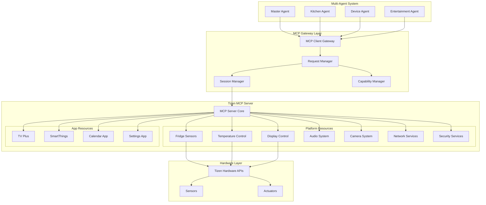

# Tizen MCP Integration Architecture

## Overview
The Tizen Model Context Protocol (MCP) Server provides a standardized interface for accessing platform capabilities and app functionalities on Samsung devices. Our multi-agent system leverages this to control device features and access sensor data.

## MCP Server Architecture



## MCP Client Implementation

### Base MCP Client
```csharp
using Microsoft.SemanticKernel;
using System.Text.Json;

namespace FamilyHub.Integration.Tizen
{
    public interface ITizenMCPClient
    {
        Task<MCPResponse> ExecuteAsync(MCPRequest request);
        Task<bool> CheckCapabilityAsync(string capability);
        Task<MCPSession> GetSessionAsync();
        Task SubscribeToEventsAsync(string eventType, Action<MCPEvent> handler);
    }

    public class TizenMCPClient : ITizenMCPClient
    {
        private readonly HttpClient _httpClient;
        private readonly ILogger<TizenMCPClient> _logger;
        private MCPSession _session;
        private readonly Dictionary<string, List<Action<MCPEvent>>> _eventHandlers;
        
        public TizenMCPClient(HttpClient httpClient, ILogger<TizenMCPClient> logger)
        {
            _httpClient = httpClient;
            _logger = logger;
            _eventHandlers = new Dictionary<string, List<Action<MCPEvent>>>();
        }
        
        public async Task<MCPResponse> ExecuteAsync(MCPRequest request)
        {
            try
            {
                // Ensure we have a valid session
                if (_session == null || _session.IsExpired)
                {
                    await InitializeSessionAsync();
                }
                
                // Add session token to request
                request.SessionToken = _session.Token;
                
                // Serialize and send request
                var json = JsonSerializer.Serialize(request);
                var content = new StringContent(json, Encoding.UTF8, "application/json");
                
                var response = await _httpClient.PostAsync("/mcp/execute", content);
                response.EnsureSuccessStatusCode();
                
                var responseJson = await response.Content.ReadAsStringAsync();
                return JsonSerializer.Deserialize<MCPResponse>(responseJson);
            }
            catch (Exception ex)
            {
                _logger.LogError(ex, "Failed to execute MCP request");
                throw new MCPException("MCP execution failed", ex);
            }
        }
        
        public async Task<bool> CheckCapabilityAsync(string capability)
        {
            var request = new MCPRequest
            {
                Resource = "system.capabilities",
                Action = "check",
                Parameters = new { capability = capability }
            };
            
            var response = await ExecuteAsync(request);
            return response.Success && (bool)response.Data;
        }
        
        public async Task SubscribeToEventsAsync(string eventType, Action<MCPEvent> handler)
        {
            if (!_eventHandlers.ContainsKey(eventType))
            {
                _eventHandlers[eventType] = new List<Action<MCPEvent>>();
                
                // Subscribe to MCP server
                var request = new MCPRequest
                {
                    Resource = "system.events",
                    Action = "subscribe",
                    Parameters = new { eventType = eventType }
                };
                
                await ExecuteAsync(request);
            }
            
            _eventHandlers[eventType].Add(handler);
        }
        
        private async Task InitializeSessionAsync()
        {
            var request = new
            {
                clientId = "family-hub-assistant",
                clientVersion = "1.0.0",
                requestedCapabilities = new[]
                {
                    "fridge.sensors",
                    "device.control",
                    "display.management",
                    "audio.playback",
                    "apps.integration"
                }
            };
            
            var json = JsonSerializer.Serialize(request);
            var content = new StringContent(json, Encoding.UTF8, "application/json");
            
            var response = await _httpClient.PostAsync("/mcp/session/init", content);
            response.EnsureSuccessStatusCode();
            
            var responseJson = await response.Content.ReadAsStringAsync();
            _session = JsonSerializer.Deserialize<MCPSession>(responseJson);
        }
    }
}
```

## Platform Resource Integrations

### 1. Fridge Sensor Integration
```csharp
public class FridgeSensorService
{
    private readonly ITizenMCPClient _mcpClient;
    
    public async Task<FridgeInventory> GetInventoryAsync()
    {
        var request = new MCPRequest
        {
            Resource = "fridge.sensors",
            Action = "getInventory",
            Parameters = new
            {
                includeImages = true,
                includeExpiry = true
            }
        };
        
        var response = await _mcpClient.ExecuteAsync(request);
        return ParseInventory(response.Data);
    }
    
    public async Task<Temperature> GetTemperatureAsync(string zone)
    {
        var request = new MCPRequest
        {
            Resource = "fridge.sensors",
            Action = "getTemperature",
            Parameters = new { zone = zone }
        };
        
        var response = await _mcpClient.ExecuteAsync(request);
        return new Temperature
        {
            Current = response.Data.current,
            Target = response.Data.target,
            Unit = response.Data.unit
        };
    }
    
    public async Task SetTemperatureAsync(string zone, double temperature)
    {
        var request = new MCPRequest
        {
            Resource = "fridge.control",
            Action = "setTemperature",
            Parameters = new
            {
                zone = zone,
                temperature = temperature,
                unit = "celsius"
            }
        };
        
        await _mcpClient.ExecuteAsync(request);
    }
}
```

### 2. Display Control Integration
```csharp
public class DisplayService
{
    private readonly ITizenMCPClient _mcpClient;
    
    public async Task ShowContentAsync(DisplayContent content)
    {
        var request = new MCPRequest
        {
            Resource = "display.control",
            Action = "showContent",
            Parameters = new
            {
                type = content.Type,
                data = content.Data,
                duration = content.Duration,
                priority = content.Priority
            }
        };
        
        await _mcpClient.ExecuteAsync(request);
    }
    
    public async Task<DisplayState> GetStateAsync()
    {
        var request = new MCPRequest
        {
            Resource = "display.control",
            Action = "getState"
        };
        
        var response = await _mcpClient.ExecuteAsync(request);
        return ParseDisplayState(response.Data);
    }
}
```

### 3. App Integration Service
```csharp
public class AppIntegrationService
{
    private readonly ITizenMCPClient _mcpClient;
    
    public async Task<TVPlusChannels> GetTVPlusChannelsAsync()
    {
        var request = new MCPRequest
        {
            Resource = "apps.tvplus",
            Action = "getChannels",
            Parameters = new
            {
                category = "all",
                includeSchedule = true
            }
        };
        
        var response = await _mcpClient.ExecuteAsync(request);
        return ParseChannels(response.Data);
    }
    
    public async Task PlayChannelAsync(string channelId)
    {
        var request = new MCPRequest
        {
            Resource = "apps.tvplus",
            Action = "playChannel",
            Parameters = new { channelId = channelId }
        };
        
        await _mcpClient.ExecuteAsync(request);
    }
    
    public async Task<SmartThingsDevices> GetSmartThingsDevicesAsync()
    {
        var request = new MCPRequest
        {
            Resource = "apps.smartthings",
            Action = "getDevices"
        };
        
        var response = await _mcpClient.ExecuteAsync(request);
        return ParseDevices(response.Data);
    }
}
```

## Event Handling

### MCP Event System
```csharp
public class MCPEventHandler
{
    private readonly ITizenMCPClient _mcpClient;
    private readonly IEventAggregator _eventAggregator;
    
    public async Task InitializeAsync()
    {
        // Subscribe to fridge events
        await _mcpClient.SubscribeToEventsAsync("fridge.door", HandleFridgeDoorEvent);
        await _mcpClient.SubscribeToEventsAsync("fridge.inventory", HandleInventoryChangeEvent);
        
        // Subscribe to system events
        await _mcpClient.SubscribeToEventsAsync("system.alert", HandleSystemAlertEvent);
        await _mcpClient.SubscribeToEventsAsync("user.presence", HandleUserPresenceEvent);
        
        // Subscribe to app events
        await _mcpClient.SubscribeToEventsAsync("apps.notification", HandleAppNotificationEvent);
    }
    
    private void HandleFridgeDoorEvent(MCPEvent evt)
    {
        _eventAggregator.Publish(new FridgeDoorEvent
        {
            IsOpen = evt.Data.isOpen,
            Duration = evt.Data.duration,
            Timestamp = evt.Timestamp
        });
    }
    
    private void HandleInventoryChangeEvent(MCPEvent evt)
    {
        _eventAggregator.Publish(new InventoryChangeEvent
        {
            Items = evt.Data.items,
            ChangeType = evt.Data.changeType,
            Timestamp = evt.Timestamp
        });
    }
}
```

## Security & Authentication

### MCP Security Model
```yaml
Authentication:
  Method: OAuth 2.0 + Device Certificate
  TokenLifetime: 3600 seconds
  RefreshStrategy: Automatic before expiry
  
Authorization:
  Model: Capability-based
  Levels:
    - Read-only (sensors, state)
    - Control (actuators, settings)
    - Admin (system settings, security)
  
Encryption:
  Transport: TLS 1.3
  Payload: AES-256-GCM for sensitive data
  
Audit:
  AllActions: Logged with timestamp and user
  Retention: 30 days
  Compliance: GDPR, CCPA
```

## Performance Optimization

### Connection Pooling
```csharp
public class MCPConnectionPool
{
    private readonly ConcurrentBag<ITizenMCPClient> _pool;
    private readonly SemaphoreSlim _semaphore;
    private readonly int _maxConnections = 10;
    
    public MCPConnectionPool()
    {
        _pool = new ConcurrentBag<ITizenMCPClient>();
        _semaphore = new SemaphoreSlim(_maxConnections);
    }
    
    public async Task<ITizenMCPClient> GetClientAsync()
    {
        await _semaphore.WaitAsync();
        
        if (_pool.TryTake(out var client))
        {
            return client;
        }
        
        return CreateNewClient();
    }
    
    public void ReturnClient(ITizenMCPClient client)
    {
        _pool.Add(client);
        _semaphore.Release();
    }
}
```

### Caching Strategy
```csharp
public class MCPCacheService
{
    private readonly IMemoryCache _cache;
    private readonly ITizenMCPClient _mcpClient;
    
    public async Task<T> GetCachedAsync<T>(string key, Func<Task<T>> factory, TimeSpan? expiry = null)
    {
        if (_cache.TryGetValue(key, out T cached))
        {
            return cached;
        }
        
        var value = await factory();
        var cacheOptions = new MemoryCacheEntryOptions
        {
            AbsoluteExpirationRelativeToNow = expiry ?? TimeSpan.FromMinutes(5)
        };
        
        _cache.Set(key, value, cacheOptions);
        return value;
    }
}
```

## Error Handling & Resilience

### Retry Policy
```csharp
public class MCPRetryPolicy
{
    private readonly IAsyncPolicy<MCPResponse> _retryPolicy;
    
    public MCPRetryPolicy()
    {
        _retryPolicy = Policy
            .HandleResult<MCPResponse>(r => !r.Success && r.IsRetryable)
            .Or<MCPException>()
            .WaitAndRetryAsync(
                3,
                retryAttempt => TimeSpan.FromSeconds(Math.Pow(2, retryAttempt)),
                onRetry: (outcome, timespan, retryCount, context) =>
                {
                    var logger = context.Values["logger"] as ILogger;
                    logger?.LogWarning($"Retry {retryCount} after {timespan}");
                });
    }
    
    public async Task<MCPResponse> ExecuteWithRetryAsync(Func<Task<MCPResponse>> action, ILogger logger)
    {
        var context = new Context { ["logger"] = logger };
        return await _retryPolicy.ExecuteAsync(action, context);
    }
}
```

## Monitoring & Telemetry

### MCP Metrics
```yaml
Metrics:
  Latency:
    - P50: < 50ms
    - P95: < 200ms
    - P99: < 500ms
  
  Throughput:
    - Requests/sec: 1000
    - Events/sec: 5000
  
  ErrorRate:
    - Target: < 0.1%
    - Alert: > 1%
  
  Availability:
    - Target: 99.9%
    - Measured: 30-day rolling
```