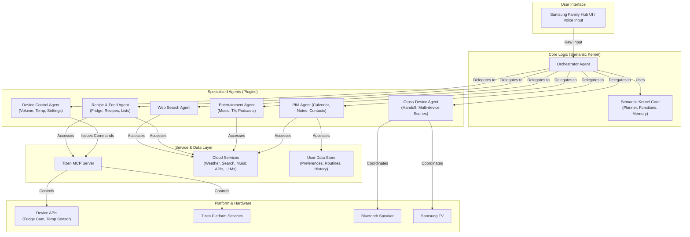

# Gemini Assistant - High-Level Architecture

### Component Descriptions

*   **Orchestrator Agent:** The brain of the system. It receives all user input. It uses the **Semantic Kernel Planner** to understand the user's intent, break down complex requests into steps, and delegate those steps to the appropriate specialized agent. For "Suggest a recipe based on what's in my fridge," it would first call the `Recipe_Food_Agent` to get inventory, then call it again to find recipes.
*   **Specialized Agents:** These are essentially "Plugins" in the Semantic Kernel terminology. Each is a self-contained set of functions for a specific domain.
    *   **Device Control Agent:** The primary client of the Tizen MCP. It handles all direct hardware interactions like `setVolume()`, `getTemperature()`, `setLight()`.
    *   **Recipe & Food Agent:** Manages fridge inventory (via MCP's camera API), searches for recipes (via a Cloud Service), and manages shopping lists (in the User Data Store).
    *   **PIM Agent:** Handles Personal Information Management. Connects to calendar/contact APIs (like Google/Outlook) and manages user-specific notes.
    *   **Cross-Device Agent:** Manages interactions that span multiple devices, handling discovery, connection, and control (e.g., "Play this on the living room TV").
*   **Tizen MCP Server:** This is the crucial abstraction layer provided by the platform. It exposes a secure and stable API for all hardware and low-level Tizen services. Our agents treat this as a single, reliable endpoint.
*   **User Data Store:** A database that stores user preferences, learned routines, conversation history, and other personalization data. This is the key to making the assistant truly personal and proactive.

